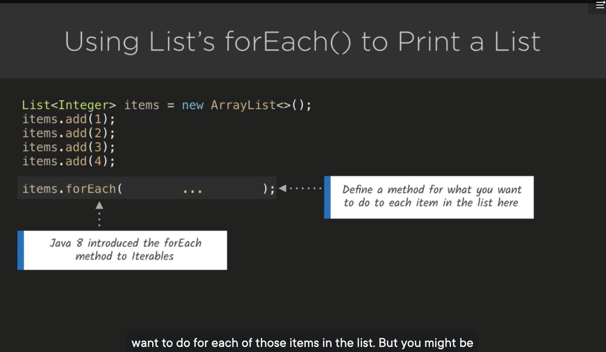

https://app.pluralsight.com/course-player?clipId=56b04312-f174-4e20-a22b-1f4ef9b4aa6f

Java: Using Lambda Expressions (Interactive) 
By Sarah Holderness

# UsingLambdaExpressions

This is Java Using Lambda Expressions

An Example of a Lambda Expression

List<Integer> items = new ArrayList<>();
items.add(1);
items.add(2);
items.add(3);
items.add(4);

items.forEach(item -> System.out.println(item*item));

It is difficult to understand why you would want to use lambda expressions without understanding how they improved upon the standard for loop.

## Before Java 8 

Using a for-each loop to print a List

List<Integer> Items = new ArrayList<>();
items.add(1);
items.add(2);
items.add(3);
items.add(4);

for(int item: items)
System.out.println(item);

## After Java 8 
Java 8 Introduced .forEach() method. 
Define a method for what you want to do to each item in the list here

 But how to pass a method as an argument?

One way is use Method Reference to forEach() method.

List<Integer> Items = new ArrayList<>();
items.add(1);
items.add(2);
items.add(3);
items.add(4);

items.forEach(System:out::println);

Method References are not flexible. Instead we can pass lambda expression , that will print the square of each Item in the list.

Lambda Expression Syntax
item -> System.out.println(item*item)
Parameter(s) -Arrow-Method body on Right

Lambda Expression - What Does the Arrow Do?

Lambda Expression - Multiline Method enclose curly braces after arrow

Using a Comparator to Sort an Array

Defining a Comparator with a Lambda Expression

https://next.tech/projects/b80fe905-2eec-40a8-8f84-aac0a85d4937?access_token=387DC0DA89D5F560A6A5125CD5F91CE1&internal=false

Challenge: Creating a Lambda Expression

Challenge: Multi-line Lambdas

https://next.tech/projects/e616e1dc-055a-424c-8d4f-2fbfe3c06ed7?access_token=DBB5123A9245B065267683AFDAB2E39F&internal=false

